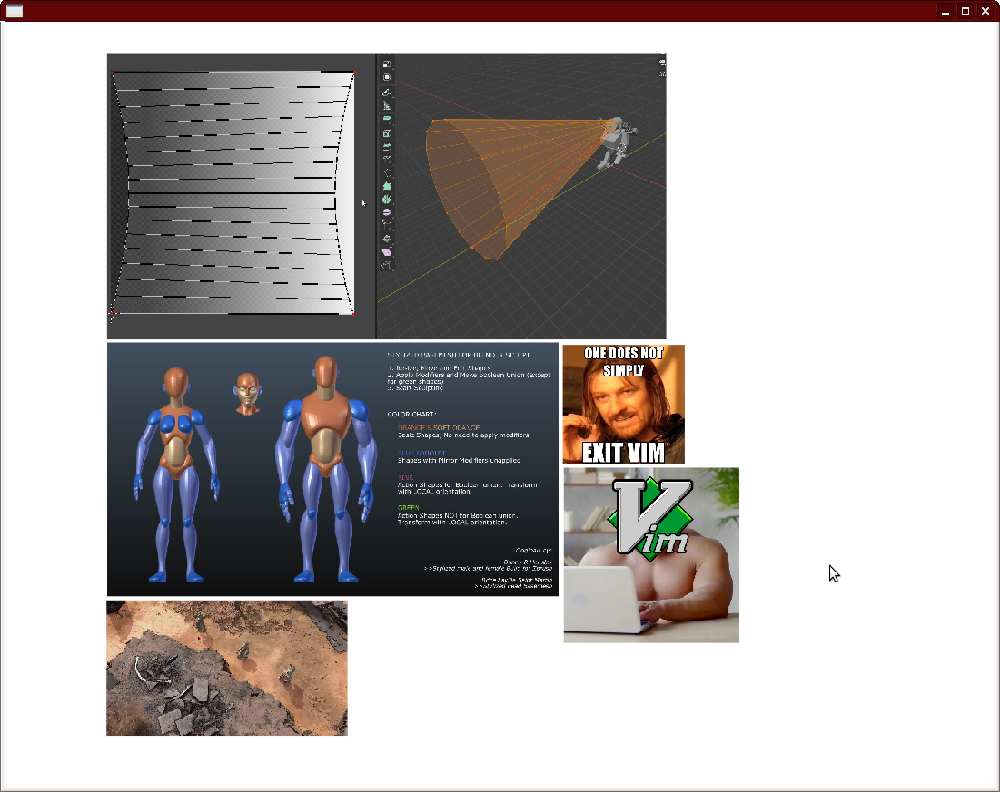

# mobo

A moodboard app.

I don't like pinterest and I wanted a moodboard app that supported gif/video
files. Plus, I just wanted to to mess around with low level gui programming in
Python.

### Features
* Drag/drop images and videos (!!!)
* Copy/paste of image file *paths* (glfw doesn't support copy/paste of raw image
  data in the clipboard unfortunately)
* Copy paste from twitter url (currently just parses out the thumbnail)
* Auto save (when you've loaded up a db file and aren't running in memory)

### Bugs
Lots of 'em. Don't use it right now.
